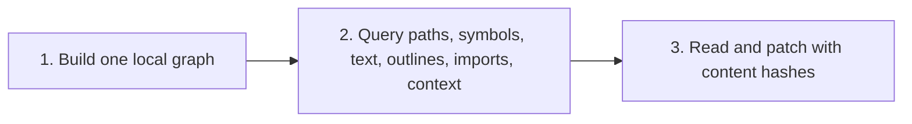

# Why Lexa

Lexa is a fast local code intelligence engine for humans and AI agents.

## The pitch

Lexa turns a codebase into a portable, queryable graph so every tool can work
from the same stable view of the project.

Instead of repeatedly scanning files ad hoc, Lexa indexes structure, text,
symbols, imports, content hashes, and recent edits into one local graph. That
gives agents:

- **Compact context** — pull only the relevant symbols, files, and snippets.
- **Traceable lookups** — every result points back to a real file path and line range.
- **Hash-aware reads** — every read returns a content hash, so edits can be
  verified against the version that was inspected.
- **Atomic line-based patches** — replace, insert, and delete operations
  reindex the touched file in one step.

## Project info

| Project | Info |
| --- | --- |
| Interface | CLI and MCP server |
| Index | `.lexa/graph.lexa` by default |
| Runtime | Native Rust binary |
| License | MIT |

## The index-first workflow

1. **Build one local graph for the project** with `lexa index .`.
2. **Query that graph** for paths, symbols, text, outlines, imports, and
   context — from the CLI or an MCP client.
3. **Read and patch files** with content hashes so edits can be checked against
   the version that was inspected.

That makes Lexa useful as a shared context layer between a developer, a
terminal workflow, and an AI agent — one local source of truth, many consumers.
